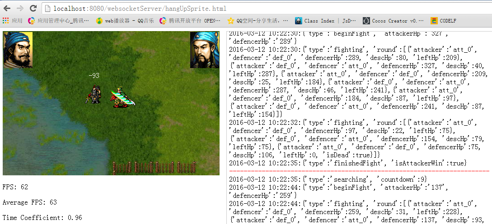

# WebSocket Server Game
使用Html5/JavaScript/WebSocket/Tomcat7/Java实现的游戏，其中有些是Tomcat7自带的WebSocket游戏例子

## 挂机游戏
素材使用《曹操传》的张飞和关羽以及地形，功能包括简单战斗的前后端实现，战斗完毕后的冷却搜寻敌人，会一直不停得重复战斗——搜寻逻辑，即挂机游戏的主要内容，但其中的战斗以及搜寻都较简单，根据后续需要可扩展

## 多人在线贪吃蛇
可多人在线一起玩贪吃蛇，具体玩法是别碰到其他玩家的身体否则会被吃掉，吃掉其他玩家的蛇会越变越长

## 多人在线画板
可多人连接一起在同一块画板上画画，可作为“你画我猜”的原型

## 多人在线聊天
最基础的聊天，除了聊天外，还包括登陆以及退出

# 注意
从上面的截图可看出配置的WebSocket URI为/webSocketServer，如果配置不同的话，需要修改下前后端的请求URI
